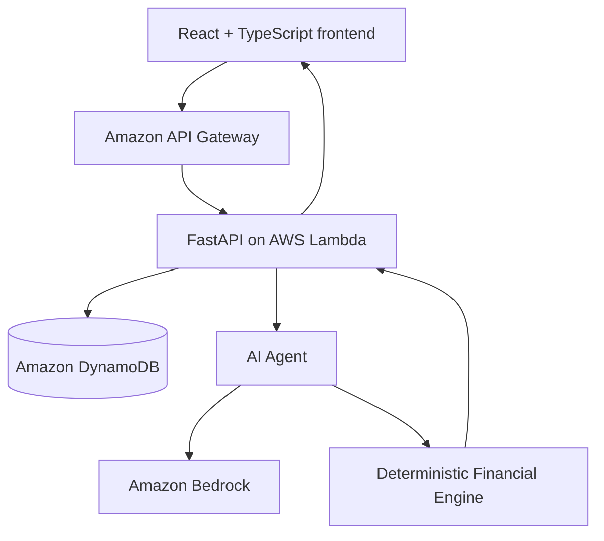

# Future You

Future You is an AI-powered financial planning dashboard that helps people explore
long-term what-if scenarios, manage savings goals, and understand how today's
financial decisions may affect their future.

It combines a financial dashboard with two agent experiences:

- **Advice mode** answers financial wellbeing questions and runs grounded simulations.
- **Manage mode** prepares reviewable changes to goals and profile data, then waits for
  explicit confirmation before saving anything.

The application can run entirely with local demo data or use Amazon Cognito,
DynamoDB, Amazon Bedrock, API Gateway, and AWS Lambda.

> **Core principle:** Bedrock understands and explains. The deterministic financial
> engine calculates. The language model never invents balances, cash flow, risk levels,
> or goal outcomes.

<!-- Add the final dashboard image at docs/images/future-you-dashboard.png. -->
<!--  -->

## Key Features

- Financial dashboard with balance, income, expenses, monthly savings, goals, and
  spending insights
- Long-term what-if simulations for purchases, recurring expenses, and extra savings
- Before-and-after comparisons covering cash flow, goal timing, and financial risk
- Advice mode with grounded follow-up questions and practical explanations
- Manage mode with signed proposals and explicit user confirmation
- Goal and spending-category management
- Amazon Cognito authentication and first-time onboarding
- DynamoDB-backed profile persistence
- Amazon Bedrock integration with a reliable mock fallback
- Deterministic Python calculations with automated tests

## How It Works

1. The customer reviews their dashboard and asks a question in natural language.
2. The AI agent classifies the request and extracts a structured scenario.
3. The backend loads the customer's profile and goals.
4. The financial engine calculates the exact result and risk level.
5. The AI explains the verified result without changing its numbers.
6. The frontend displays the response and, when applicable, a before-and-after panel.

Example questions:

- `What happens if I buy a $2,000 laptop?`
- `What if my rent increases by $100 per week?`
- `What if I save an extra $50 per week for my emergency fund?`
- `How should I budget better?`

Advice mode supports follow-up questions during the current page session. Manage mode
can collect goal details across several messages and create a signed preview. Changes
are saved only after the customer confirms that preview.

## Architecture



The same application can run locally without AWS. In mock mode, the backend uses the
synthetic Alex profile and deterministic agent fallbacks while preserving the same API
and calculation flow.

## Technology Stack

| Layer | Technologies |
|---|---|
| Frontend | React, TypeScript, Vite, Material UI, Recharts, AWS Amplify |
| API | FastAPI, Pydantic, Mangum, AWS Lambda, API Gateway |
| AI agent | Amazon Bedrock Converse API, boto3, deterministic fallbacks |
| Financial engine | Python, `Decimal`, rule-based risk assessment |
| Authentication | Amazon Cognito or local mock identity |
| Data | Amazon DynamoDB or local JSON/CSV demo data |
| Quality | pytest, Ruff, ESLint, TypeScript |

## Local Development

### Prerequisites

- Python 3.12
- Node.js 20 or later
- npm
- Two terminal windows
- AWS credentials only when using AWS mode

### Runtime Modes

| Mode | Authentication | Data | AI |
|---|---|---|---|
| Local mock | Mock | Local demo data | Mock |
| Local with AWS | Cognito | DynamoDB | Bedrock |
| Cloud deployment | Cognito | DynamoDB | Bedrock |

Use the modes as complete profiles. `mock/mock/mock` is the AWS-free demo;
`cognito/dynamodb/bedrock` is the AWS profile. Mixing adapters is supported for
development diagnostics but is not a normal application mode.

### Backend Setup

From the repository root:

```bash
cd backend
python -m venv .venv
source .venv/bin/activate
pip install -r requirements.txt
export PYTHONPATH="../:."
```

On Windows PowerShell, activate the environment with:

```powershell
.\.venv\Scripts\Activate.ps1
```

### Mock Mode

Mock mode requires no AWS account or API key:

To start both the backend and frontend from the repository root:

```bash
./start-dev.sh
```

This mode supports the complete product flow, including profile edits, goal changes,
spending updates, Advice mode, Manage previews, and applying confirmed proposals.
Updated profiles are stored under `backend/.local/mock-customers/` so they survive a
restart without modifying the checked-in demo fixtures. Delete that directory when
you intentionally want to reset the local demo data.

Press `Ctrl+C` to stop both services. Alternatively, start each service separately
using the commands below. The script overrides Cognito/AWS mode settings and starts
both services in the complete local Mock profile.

```bash
cd backend
source .venv/bin/activate
export PYTHONPATH="../:."
export AUTH_MODE=mock
export DATA_SOURCE=mock
export AI_MODE=mock
uvicorn app.main:app --host 127.0.0.1 --port 8000 --reload
```

The API is available at <http://127.0.0.1:8000>, with interactive documentation at
<http://127.0.0.1:8000/docs>.

In a second terminal:

```bash
cd frontend
npm install
cp .env.example .env.local
npm run dev
```

Set `frontend/.env.local` to:

```env
VITE_API_URL=http://127.0.0.1:8000
VITE_AUTH_MODE=mock
```

Open <http://127.0.0.1:5173>.

### AWS Mode

Configure Cognito, DynamoDB, Bedrock, and backend credentials by following
[`docs/AWS_AUTH_SETUP.md`](docs/AWS_AUTH_SETUP.md). Export the documented backend and
frontend variables, then use the validated AWS launcher:

```bash
./start-aws.sh
```

The launcher refuses to start a partially configured AWS profile. It lists every
missing variable and points back to the setup guide. `start-dev.sh` remains the
AWS-free Mock launcher.

The Bedrock client uses boto3's standard credential chain. An AWS SSO/profile session,
Lambda execution role, or `AWS_BEARER_TOKEN_BEDROCK` can provide credentials. Never
commit credentials, tokens, signing keys, or populated `.env` files.

Configure the frontend:

```env
VITE_API_URL=http://127.0.0.1:8000
VITE_AUTH_MODE=cognito
VITE_COGNITO_USER_POOL_ID=your-user-pool-id
VITE_COGNITO_USER_POOL_CLIENT_ID=your-app-client-id
```

To verify Bedrock connectivity:

```bash
cd backend
source .venv/bin/activate
export PYTHONPATH="../:."
export AWS_PROFILE=future-you
python -m agent.scripts.test_bedrock
```

## Environment Variables

### Backend and Agent

| Variable | Purpose | Typical value |
|---|---|---|
| `AUTH_MODE` | Select authentication provider | `mock` or `cognito` |
| `DATA_SOURCE` | Select profile storage | `mock` or `dynamodb` |
| `AI_MODE` | Select agent implementation | `mock` or `bedrock` |
| `AWS_REGION_NAME` | AWS region for Cognito, DynamoDB, and Bedrock | `ap-southeast-2` |
| `AWS_PROFILE` | Optional local AWS CLI/SSO profile | `future-you` |
| `COGNITO_USER_POOL_ID` | Cognito user pool used to validate tokens | AWS resource ID |
| `COGNITO_APP_CLIENT_ID` | Cognito application client | AWS resource ID |
| `CUSTOMER_TABLE_NAME` | DynamoDB profile table | `future-you-users` |
| `BEDROCK_MODEL_ID` | Bedrock model used by the agent | `amazon.nova-lite-v1:0` |
| `AGENT_PROPOSAL_SIGNING_KEY` | Signs Manage-mode proposals | Long random secret |
| `FRONTEND_URL` | Comma-separated browser origins allowed by CORS | Local or deployed frontend URL |
| `FUTURE_YOU_MOCK_STATE_DIR` | Optional local Mock profile storage | `backend/.local/mock-customers` |
| `FUTURE_YOU_DATA_DIR` | Optional local demo-data override | Directory path |

### Frontend

| Variable | Purpose |
|---|---|
| `VITE_API_URL` | FastAPI or API Gateway base URL |
| `VITE_AUTH_MODE` | `mock` or `cognito` |
| `VITE_COGNITO_USER_POOL_ID` | Cognito user pool ID |
| `VITE_COGNITO_USER_POOL_CLIENT_ID` | Cognito application client ID |

See `backend/.env.example`, `agent/.env.example`, and `frontend/.env.example` for
copyable templates.

## API

Authentication is required when `AUTH_MODE=cognito`. Mock mode supplies a local demo
identity automatically.

| Method | Endpoint | Purpose | Authentication |
|---|---|---|---|
| `GET` | `/health` | Check API health | No |
| `GET` | `/customer/{customer_id}` | Load a customer in mock mode | Mock only |
| `GET` | `/me/profile` | Load the current user's profile | Yes |
| `PUT` | `/me/profile` | Complete onboarding or replace the profile | Yes |
| `POST` | `/me/goals` | Add a savings goal | Yes |
| `DELETE` | `/me/goals/{goal_id}` | Delete a savings goal | Yes |
| `PUT` | `/me/spending-categories` | Update spending categories and derived savings | Yes |
| `POST` | `/simulate` | Run Advice mode or a what-if simulation | Yes |
| `POST` | `/agent/manage` | Prepare a reviewable Manage proposal | Yes |
| `POST` | `/agent/proposals/apply` | Verify and apply a confirmed proposal | Yes |

Example simulation request:

```json
{
  "customerId": "alex",
  "question": "Can I buy a laptop for $2000?"
}
```

For general coaching questions, `/simulate` returns `result: null`; the frontend shows
the explanation without opening the comparison panel.

## Testing

Run the frontend checks:

```bash
cd frontend
npm run lint
npm run build
```

Run backend and agent checks:

```bash
cd backend
source .venv/bin/activate
python -m ruff check . ../agent
python -m pytest
```

Tests cover API behaviour, authentication, profile operations, deterministic financial
calculations, risk assessment, Advice and Manage routing, Bedrock responses, fallbacks,
and profile-specific virtual users.

## AWS Deployment

The cloud path is:

```text
React application
    → Amazon API Gateway
    → FastAPI through Mangum on AWS Lambda
    → Amazon Cognito, DynamoDB, and Amazon Bedrock
```

- Follow [`docs/AWS_AUTH_SETUP.md`](docs/AWS_AUTH_SETUP.md) for Cognito, DynamoDB,
  permissions, frontend configuration, and route protection.
- Run `./build-lambda.sh` to create a Python 3.12, x86_64 Lambda deployment package
  at `backend/future-you-backend.zip`.
- The Lambda entry point is `app.lambda_handler.handler`.
- Include both `backend/app/` and the top-level `agent/` package in the deployment
  artifact.
- Point `VITE_API_URL` at the deployed API Gateway base URL.
- Grant the Lambda execution role only the required DynamoDB and Bedrock permissions,
  and use CloudWatch for runtime logs.

Generated Lambda artifacts under `backend/build/` and
`backend/future-you-backend.zip` are intentionally not committed.

## Project Structure

```text
future-you/
├── agent/                         AI understanding, coaching, explanations, and safety
│   ├── advice.py                  Advice routing and grounded follow-ups
│   ├── manager.py                 Multi-turn Manage proposals
│   ├── manage_policy.py           Unsupported-action and proposal safety boundary
│   ├── bedrock_client.py          Amazon Bedrock Converse client
│   ├── scenario_parser.py         Deterministic mock parser and fallback
│   └── tests/                     Agent and virtual-user tests
├── backend/
│   ├── app/
│   │   ├── financial_tools/       Deterministic calculation engine
│   │   ├── models/                Pydantic request and response models
│   │   ├── services/              Auth, profile, simulation, and proposal services
│   │   ├── lambda_handler.py      AWS Lambda adapter
│   │   └── main.py                FastAPI routes
│   ├── data/                      Synthetic customer and transaction data
│   ├── tests/                     Backend and calculation tests
│   └── requirements-lambda.txt    Lambda deployment dependencies
├── frontend/
│   └── src/
│       ├── components/            Dashboard, authentication, chat, and simulation UI
│       ├── context/               Authentication state
│       ├── data/                  Local demo customer
│       └── lib/                   API, auth, formatting, and frontend types
├── docs/
│   └── AWS_AUTH_SETUP.md          Cognito and DynamoDB configuration
└── README.md
```

The AI Agent is responsible for intent, conversation, and clear explanations. The
Financial Engine is responsible for all balances, monthly cash flow, goal projections,
recommendations, and risk classifications.

## Security and Design Principles

- Manage mode never writes directly; it creates a signed proposal that the user must
  review and confirm.
- The agent cannot transfer money, make payments, trade investments, close accounts,
  or perform other irreversible banking actions.
- Bedrock does not calculate or alter financial values. Explanations are grounded in
  verified engine output, with deterministic fallbacks when validation fails.
- Cognito JWTs protect user-specific routes in AWS mode, and the backend—not the
  browser—accesses DynamoDB.
- Secrets and AWS credentials belong in the runtime environment or a managed secret
  store, never in source control.
- Future You provides educational financial wellbeing guidance, not personalised
  professional financial advice.

## Current Limitations

- Conversation history lasts only for the current page session.
- The simulation engine currently supports one-time purchases, recurring expense
  changes, and additional savings.
- It does not model tax, inflation, investment returns, debt interest or amortisation,
  exchange-rate movements, or full mortgage and KiwiSaver products.
- The prototype uses synthetic customer and transaction data; it does not connect to a
  real bank account.
- General educational answers may discuss unsupported topics, but the app does not show
  a numeric simulation panel for calculations outside the verified engine boundary.

## License

No open-source license has been added yet. Until one is provided, all rights are
reserved by the project authors.
